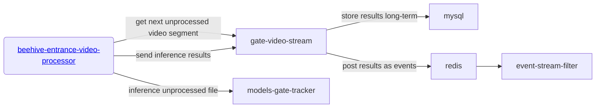

# beehive-entrance-video-processor
Beehive entrance video processing service. Manages video inferencing. Can be deployed on edge

## URLs
- localhost:8400

## Architecture

```mermaid
flowchart LR
	beehive-entrance-video-processor("<a href='https://github.com/Gratheon/beehive-entrance-video-processor'>beehive-entrance-video-processor</a>") --"get next unprocessed video segment"--> gate-video-stream
	beehive-entrance-video-processor --"inference unprocessed file" --> models-gate-tracker
	beehive-entrance-video-processor --"send inference results"--> gate-video-stream -- "store results long-term" --> mysql
	gate-video-stream -- "post results as events" --> redis --> event-stream-filter

```
