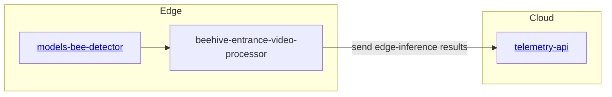
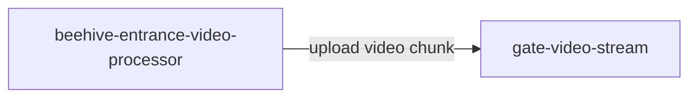
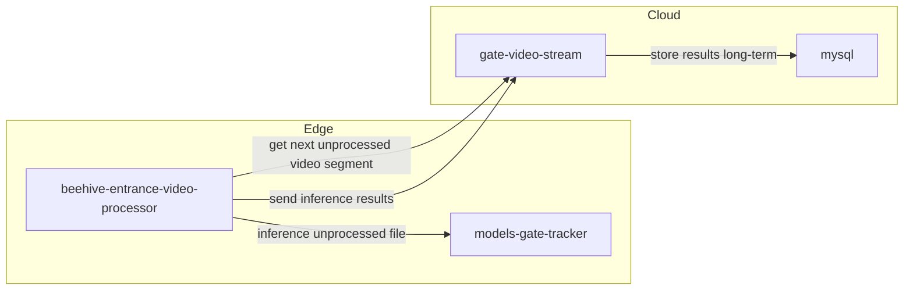

# beehive-entrance-video-processor
Beehive entrance video processing service. Manages video inferencing. Can be deployed on edge

## URLs
- localhost:8400

## Architecture

### Edge Inference


### Video chunk upload for observation & playback
See video_camera_server.py


### Distributed GPU inference assistance



### Installation
```
pip3 install picamera requests requests_toolbelt
```