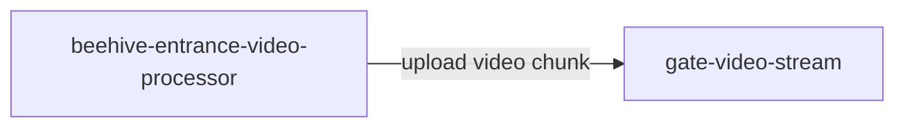
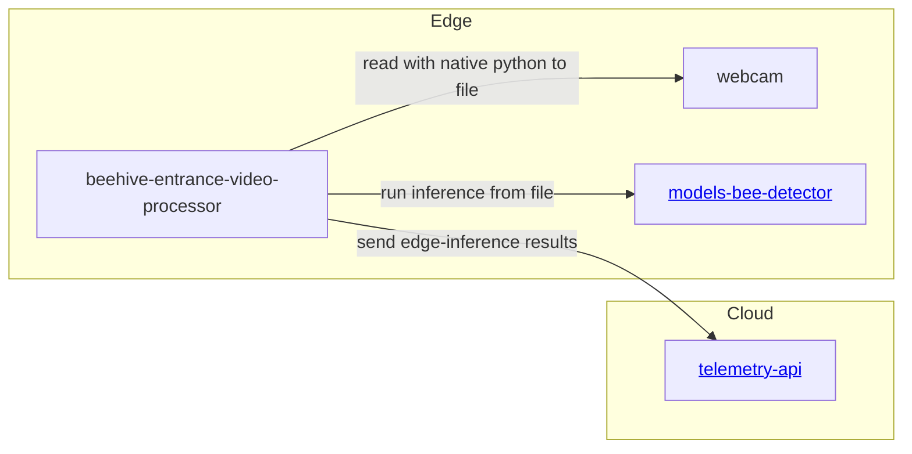
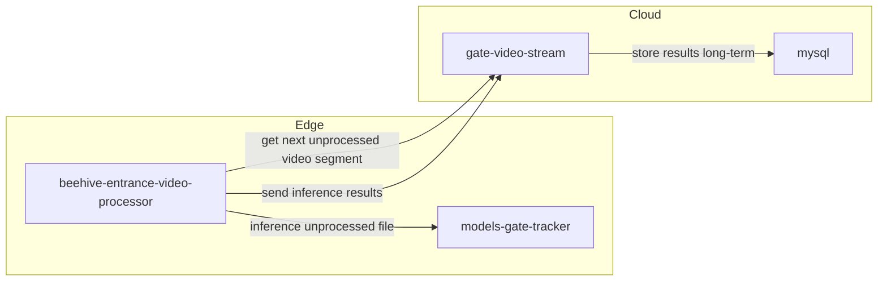

# beehive-entrance-video-processor
Beehive entrance video processing service. Manages video inferencing. Can be deployed on edge


## Installation & Usage

``` 
git clone https://github.com/Gratheon/beehive-entrance-video-processor.git
```

### Jetson Nano with dual CSI cameras
- Generate API token in https://app.gratheon.com/account
- Open your hive entrance view, ex https://app.gratheon.com/apiaries/55/hives/68/box/250 and use BOX_ID from the end of URL, ex. 250.
- Pass these environment params:
```bash
python3 -m pip install -r requirements.txt
API_TOKEN=... BOX_ID=... && python3 python-client/video_camera_server.py
```

## Architecture

### Video chunk upload for observation & playback
See video_camera_server.py



### Edge Inference (TODO)
We separate webcam from inference mostly because inference is dockerized while webcam uses local window for preview.


### Distributed GPU inference assistance (TODO)

