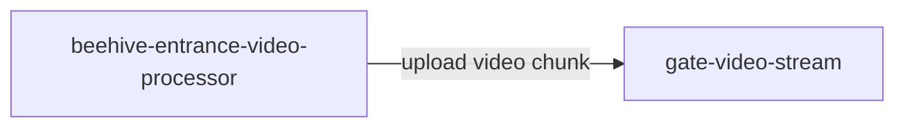
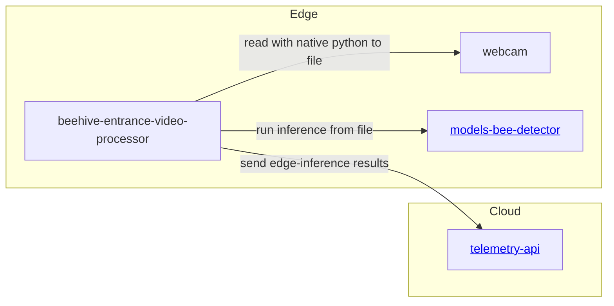
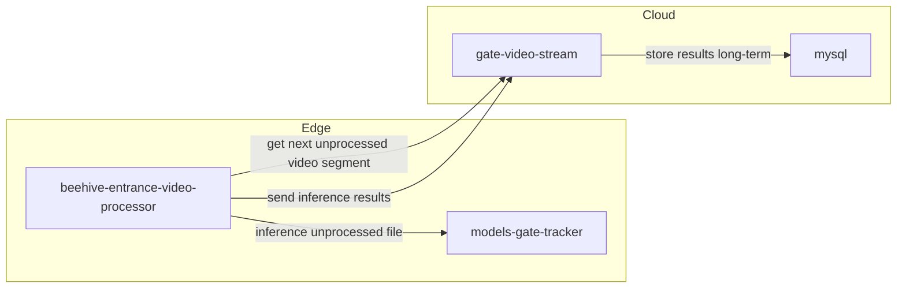

# gratheon / entrance-observer

Beehive entrance video processing service. Manages video inferencing. 
Intended to be deployed on edge on NVidia Jetson Orin or NVidia Jetson Nano


https://github.com/user-attachments/assets/a3243245-34a8-4626-a990-f7e34b7b8ff6


## Features

- Uses 4K USB video camera stream as input, stores it into 10 sec chunks
  - Tried dual CSI cameras too, it could work too, but quality was not sufficient
- Uploads video chunks to gratheon web-app for playback
- Runs bee detection

## Installation & Usage

```
git clone https://github.com/Gratheon/entrance-observer.git
```
- Generate API token in https://app.gratheon.com/account
- Open your hive entrance view, ex https://app.gratheon.com/apiaries/55/hives/68/box/250 and use BOX_ID from the end of URL, ex. 250.
- Pass these environment params:

```bash
python3 -m pip install -r requirements.txt
API_TOKEN=... BOX_ID=... && python3 video_camera_server.py
```

## Architecture

### Video chunk upload for observation & playback

See video_camera_server.py



### Edge Inference (TODO)

We separate webcam from inference mostly because inference is dockerized while webcam uses local window for preview.



### Distributed GPU inference assistance (TODO)


